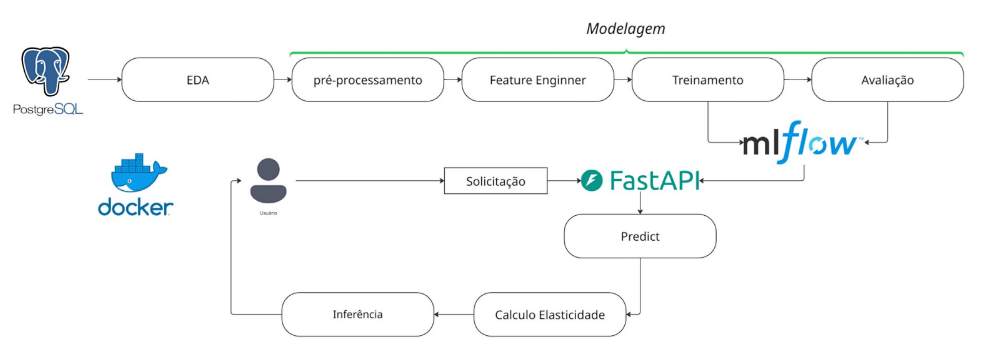

# Elasticidade de Preço | ML Regressor 
Este projeto auxilia na **tomada de decisão de preços** ao estimar como mudanças de preço afetam a receita.  
Por exemplo:  
- Um aumento de **10% no preço** pode resultar em:  
  - **+7% de receita** em produtos com demanda inelástica;  
  - **-12% de receita** em produtos com demanda elástica.  

Assim, é possível identificar **quais produtos suportam reajustes** sem perda significativa de volume e **quais devem ser mais sensíveis em promoções**.  

---
## Objetivo  
- Calcular a **elasticidade-preço da demanda**;  
- Prever a quantidade demandada com **RandomForest Regressor**;  
- Integrar os modelos em um pipeline versionado com **MLflow**;  
- Disponibilizar o modelo via **API (FastAPI)**;  
- Criar um **painel interativo no Streamlit** para análise e uso prático;  
- Seguir boas práticas de arquitetura, usando **Strategy Pattern** para separar lógicas de cálculo/modelagem;  
- Garantir qualidade com **testes automatizados**.  

---

## Fluxo do Projeto  

*(Aqui entra sua imagem do fluxograma — ex: `/docs/fluxo.png`)*  

1. **Entrada de Dados Simples** → Dados de preço e quantidade.  
2. **EDA (Exploratory Data Analysis)** → Estatísticas descritivas e gráficos básicos.  
3. **Cálculo de Elasticidade** → Implementação da função de elasticidade-preço.  
4. **Treinamento de Modelo** → Previsão de quantidade com RandomForest Regressor.  
5. **Pipelines** → Salvos e versionados via MLflow.  
6. **Testes Unitários e de Integração** → Validação de funções e modelos.  
7. **API** → FastAPI servindo cálculos de elasticidade.  
8. **Dashboard** → Streamlit exibindo insights e simulações de elasticidade.  

---

## 🛠️ Tecnologias Utilizadas  

- **Python 3.10+**  
- **Pandas / Numpy** – Manipulação de dados  
- **Scikit-learn** – Modelagem (RandomForest Regressor)  
- **MLflow** – Versionamento e tracking de experimentos  
- **FastAPI** – Servir a API de elasticidade  
- **Streamlit** – Dashboard interativo  
- **Matplotlib / Seaborn** – Visualizações para EDA  
- **Pytest** – Framework de testes  

---

## 📐 Estrutura do Projeto  
├── data/ # Dados de entrada (exemplo)
├── notebooks/ # EDA e experimentação
├── src/
│ ├── eda/ # Scripts de análise exploratória
│ ├── models/ # Treinamento e previsão
│ ├── strategies/ # Implementação do Strategy Pattern
│ ├── api/ # Endpoints FastAPI
│ └── dashboard/ # Painel Streamlit
├── tests/ # Testes unitários e de integração
├── mlruns/ # Artefatos do MLflow
├── requirements.txt # Dependências
└── README.md # Este arquivo

# Demonstração

API: http://localhost:8000/docs

Dashboard: http://localhost:8501

# 📦 Próximos Passos

- Ampliar cobertura de testes automatizados;
- Adicionar mocks para API e banco de dados;
- Integrar banco de dados real (ex: Postgres);
- Implementar CI/CD com GitHub Actions;
- Containerização com Docker.
